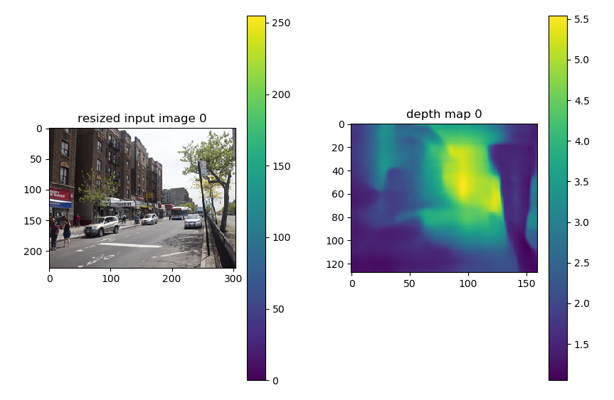

# deeplens
A multimedia query processing engine

## Installation requirements:
pip install -r requirements.txt

## Demo
For the full basic demo of the current functionality run:

```bash
python run.py --is_debug=True
```

## Running the predictinon depths for image(s) separately:
This is a depth prediction from a single RGB image.

We used the state-of-the-art image depth prediction described 
in the paper 
[Deeper Depth Prediction with Fully Convolutional Residual Networks](https://arxiv.org/abs/1606.00373).
The code for depth prediction is based on their provided
[implementation](https://github.com/iro-cp/FCRN-DepthPrediction).

*The provided model was used to obtain the results 
reported in the [paper](https://arxiv.org/abs/1606.00373) on the 
benchmark datasets NYU Depth v2 and Make3D for indoor and outdoor 
scenes respectively.*

**Such a trained model can be used for inference on *arbitrary*
images.**


```bash
# go to depth_prediction folder:
cd depth_prediction

# get depth map for a single image

PYTHONPATH=../ python predictor.py --image_path=../resources/demo/image.jpg

# get depth maps for all images in the given directory
PYTHONPATH=../ python predictor.py --image_path=../resources/demo/
```

Example of a resized input image and the output depth map:
